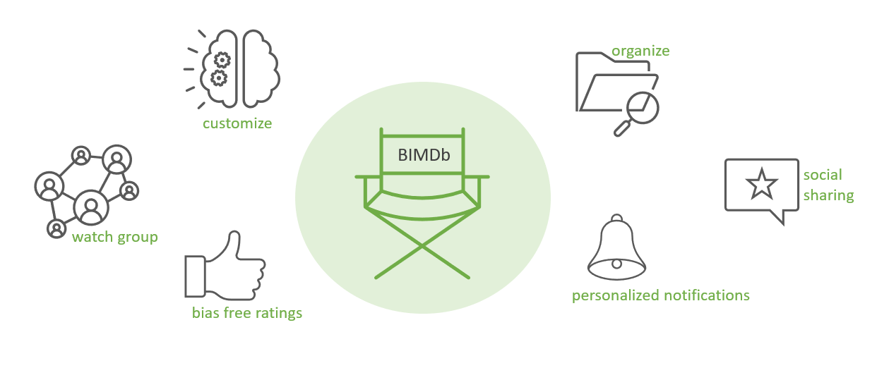

# 🎬 BIMDB - Better Internet Movie Database

The _Better Internet Movie Database_ (BIMDB) is a feature-rich film database that leverages external providers, such as IMDB, to offer users personalized recommendations, advanced search and filter functions, watchlist management, and social media integration. BIMDB redefines the way users discover and engage with movies.  


## 🎥 Table of Contents
  - [📝 Summary](#-summary)
  - [🚀 Deployment](#-deployment)
  - [👥 Authors](#-authors)
  - [👩‍🏫 Instructors](#-instructors)
  - [🦺 Contribution](#-contribution)

For additional information, please visit our [🎉awesome Wiki🎉](https://gabrielbenabou.gitlab.io/bimdb/).

## 📝 Summary

BIMDB, the Better Internet Movie Database, is a feature-rich film database designed to enhance your movie discovery experience. It leverages the IMDB API to provide users with access to a vast collection of movies. With BIMDB, you can easily search for films, apply advanced filters, and discover both popular and lesser-known titles. The application offers personalized recommendations based on your viewing history and preferences, allowing you to uncover new and exciting movies. Additionally, BIMDB provides a watchlist feature to keep track of movies you want to watch and a rating system to share your thoughts on films. Seamlessly integrated with social media, you can easily share your favorite movies with friends and followers. BIMDB redefines the way you engage with movies, making your film-watching journey more enjoyable and interactive.



## 🚀 Deployment

To deploy BIMDB, you will need to meet the following prerequisites:

- **Kubernetes Cluster:** Ensure that you have a Kubernetes cluster set up and running. BIMDB relies on Kubernetes for deployment and orchestration of its services.

- **Helm:** Helm is a package manager for Kubernetes that simplifies the deployment and management of applications. Make sure you have Helm installed on your system.

Once you have the prerequisites in place, follow the steps below to deploy BIMDB:

1. Download the latest release of BIMDB from [here](https://gitlab.com/gabrielbenabou/bimdb/-/releases).

2. Modify the [values](./K8s/values.yaml) in the `values.yaml` file located in the `K8s` directory to configure the deployment according to your requirements. Adjust any necessary settings, such as database credentials, service ports, or resource allocations.

3. Install BIMDB using Helm Charts:
   ```shell
   helm upgrade --install --namespace=betterimdb -f ./K8s/values.yaml bimdb ./K8s
   ```

4. Wait for the deployment to complete. You can check the status of the pods by running the following command:

    ```shell
    kubectl get pods -n betterimdb
    ```

5. Once the deployment is successful, you can access BIMDB by opening your web browser and navigating to the appropriate URL.

6. Explore the BIMDB features and functionalities:

    - **🔍 Search and Filter:** Use the intuitive search to find movies based on various criteria such as title, actors, and more.
    - **🎯 Personalized Recommendations:** Discover new movies tailored to your preferences and viewing history through personalized recommendations. (Registration is needed)
    - **📤 Sharing:** Seamlessly share your favorite movies with friends and followers on popular social media platforms by link.
    - **➕ Additional Features:** Explore additional features like movie details, cast and crew information, straming providers, and more.

## 👥 Authors
- Aschmann Dominik
- Ben Abou Levy Gabriel
- Brändli Yves
- Dias Pinto Cristina
- Diethelm Pascal
- Kindle Tristan
- Oriet Nils
- Schaefle David

For Software Project 4, Spring Semester 2023

## 👩‍🏫 Instructors
- Baumgartner Patrick
- Schnatz Nina Isabelle

## 🦺 Contribution
For more information on how to contribute, check out our [Contribution](https://gabrielbenabou.gitlab.io/bimdb/projektorganisation/contribution/) guidelines in the Wiki.