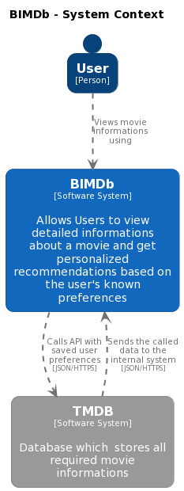
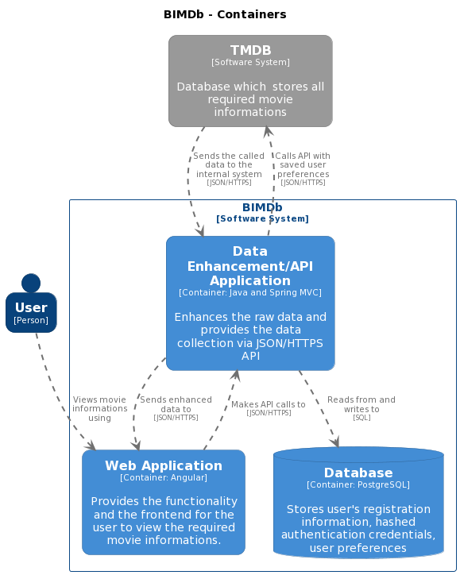
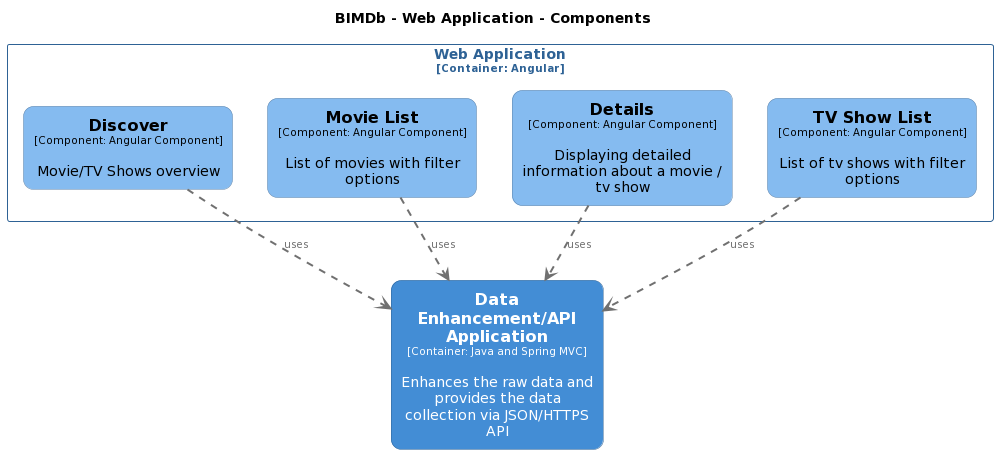
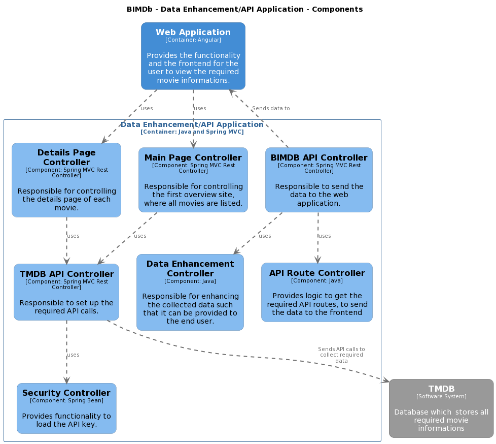

# C4 Diagramme

Die nachfolgenden Darstellungen zeigen die Architektur des Projektes, wobei die Levels 1-3 in C4 Modellen beschrieben werden.

## System Context Diagramm 

## Container Diagramm

## Komponenten Diagramme

