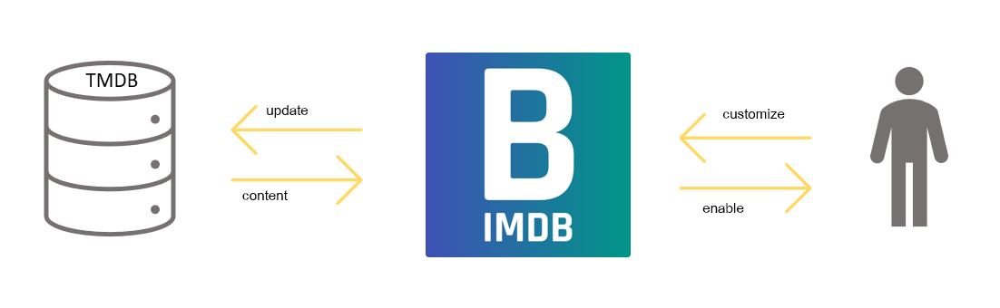

# Ausgangslage und Idee

Filme und Serien zu schauen war noch nie so einfach wie heute. Plattformen wie Netflix überschwemmen uns mit ständig neuen Produktionen, die bequem über eine App online gestreamt werden können. Dabei fällt jedoch auf, dass bei einer solchen Vielfalt von Filmen und Serien man leicht den Überblick verlieren kann. Sicherlich kennen viele auch das Bedürfnis, ihren Freunden auf Social Media von einem neu entdeckten Film oder einer Serie zu berichten, die sie gerade gesehen haben. Vielleicht möchte man sich auch bestimmte Notizen zum Film machen, wie zum Beispiel was einem besonders gefallen hat oder an welcher Stelle man aufgehört hat zu schauen.

Aus diesen und weiteren Gründen entstand die Idee von BIMDb. BIMDb soll das Filmerlebnis unterstützen und auf eine neue Stufe heben. Das Anschauen von Filmen und Serien soll interaktiver und organisierter gestaltet werden, ohne das Erlebnis unnötig zu belasten. Unser Ziel ist es, eine App zu entwickeln, die das Filmerlebnis so einfach wie möglich macht und dabei die Bedürfnisse der Nutzer berücksichtigt. Wir glauben, dass unsere App Film- und Serienfans dabei unterstützen wird, ihre Inhalte besser zu organisieren und somit ihr Filmerlebnis zu optimieren.

