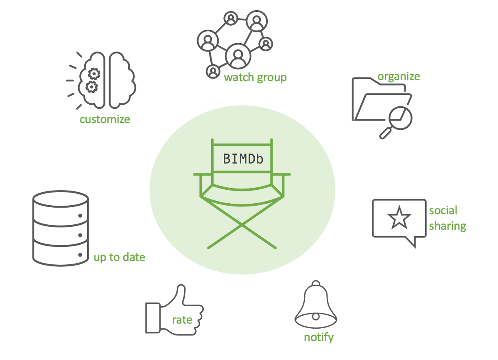

# Ausgangslage und Idee

Filme zu schauen war vermutlich noch nie so einfach wie heute. Plattformen wie Netflix überschwemmen uns mit ständig neuen Produktionen, die bequem über eine Applikation online gestreamt werden können [^1]. Eine zentrale Herausforderung dabei ist, das Angebot qualitativ zu evaluieren. Das Bedürfnis der Konsumenten geht dahingehend meist noch über die reine Evaluation hinaus. Den besten Freunden auf Social Media von einem neu entdeckten Film zu berichten, erfreut sich zunehmender Popularität [^2]. Ein weiteres Bedürfnis der Konsumenten sind objektive Kritiken, frei von Vorurteilen. Benutzer von Applikationen wie IMDb wollen zudem dediziert Informationen zum Film sammeln, beispielsweise was ihnen besonders gefallen hat oder an welcher Stelle sie aufgehört haben zu schauen [^3].

Aus diesen und weiteren Gründen entstand die Idee von BIMDb. BIMDb soll das Filmerlebnis auf eine neue Stufe heben. Das Konsumieren von Filmen soll interaktiver und bewusster werden, ohne das Erlebnis mit Mehraufwänden zu belasten. Das Ziel von BIMDb ist es, eine Applikation zu entwickeln, die das Filmerlebnis so einfach wie möglich macht und dabei die Bedürfnisse der Benutzer berücksichtigt. Mit der Absicht Filmfans zu unterstützen, die Inhalte besser zu evaluieren und zu popularisieren und somit das Filmerlebnis zu optimieren.

[^1]: Finanztip Verbraucherinformation GmbH (2023) Streaming: Finde den Anbieter, der zu Dir passt [Online]. URL: https://www.finanztip.de/streaming/ (Stand 30.03.2023)

[^2]: Verlag Werben & Verkaufen GmbH [W&V] (2023) Wie Netflix und Co. auf Social Media punkten [Online]. URL: https://www.wuv.de/Archiv/Wie-Netflix-und-Co.-auf-Social-Media-punkten (Stand 31.03.2023)

[^3]: IONOS (2023) Bewertungen auf Websites: So wichtig sind Ratings und Kommentar-Boxen [Online]. URL: https://www.ionos.de/digitalguide/websites/webseiten-erstellen/bewertungen-auf-websites-warum-sind-sie-so-wichtig/ (Stand 28.03.2023)
