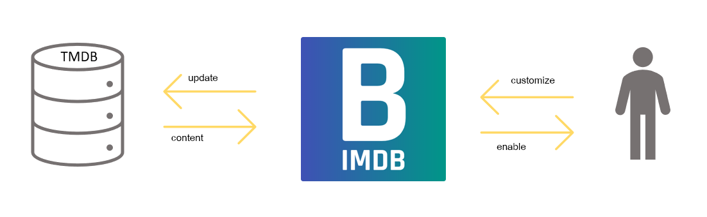

# Ausgangslage und Idee

Filme und Serien zu schauen war vermeintlich noch nie so einfach wie heute. Plattformen wie Netflix überschwemmen uns mit ständig neuen Produktionen, die bequem über eine App online gestreamt werden können [^1]. Eine zentrale Herausforderung dabei ist, das Angebot qualitativ zu evaluieren. Das Bedürfnis der Konsumenten geht meist noch über die reine Evaluation hinaus. Den besten Freunden auf Social Media von einem neu entdeckten Film oder einer Serie zu berichten, erfreut sich zunehmender Popularität [^2]. Ein weiteres Bedürfniss der Konsumenten sind Notizen zum Film machen, wie zum Beispiel was einem besonders gefallen hat oder an welcher Stelle man aufgehört hat zu schauen [^3].

Aus diesen und weiteren Gründen entstand die Idee von BIMDb. BIMDb soll das Filmerlebnis auf eine neue Stufe heben. Das Konsumieren von Filmen und Serien soll interaktiver werden, ohne das Erlebnis mit Mehraufwand zu belasten. Das Ziel von BIMDB ist es, eine App zu entwickeln, die das Filmerlebnis so einfach wie möglich macht und dabei die Bedürfnisse der Nutzer berücksichtigt. In der Absicht Film- und Serienfans zu unterstützen, die Inhalte besser zu organisieren und somit das Filmerlebnis zu optimieren.

[^1]: Finanztip Verbraucherinformation GmbH (2023) Streaming: Finde den Anbieter, der zu Dir passt [Online]. URL: https://www.finanztip.de/streaming/ (Stand 30.03.2023)

[^2]: Verlag Werben & Verkaufen GmbH [W&V] (2023) Wie Netflix und Co. auf Social Media punkten [Online]. URL: https://www.wuv.de/Archiv/Wie-Netflix-und-Co.-auf-Social-Media-punkten (Stand 31.03.2023)

[^3]: IONOS (2023) Bewertungen auf Websites: So wichtig sind Ratings und Kommentar-Boxen [Online]. URL: https://www.ionos.de/digitalguide/websites/webseiten-erstellen/bewertungen-auf-websites-warum-sind-sie-so-wichtig/ (Stand 28.03.2023)