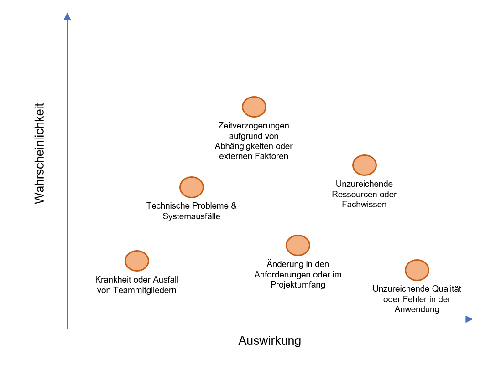

# Risikomanagement

Bei jedem Projekt gibt es verschiedene Risikoquellen, welche soweit wie möglich einkalkuliert werden sollten. Insbesondere ist es entscheidend, dass man auf eine mögliche Realisierung eines Risikos vorbereitet reagieren kann [^1]. Entsprechend ist ein solides Risikomanagement für den Erfolg eines Projektes unabdingbar. Nachfolgend wird auf verschiedene Risiken im Zusammenhang mit BIMDb eingegangen und erläutertn, wie man diese vorbeugen will.

**Krankheit oder Ausfall von Teammitgliedern**

Um das Risiko von Arbeitsausfällen aufgrund von Krankheiten oder anderen unvorhergesehenen Umständen zu minimieren, wird darauf geachtet, dass die Aufgaben und Zuständigkeiten innerhalb des Teams gut dokumentiert sind. Zudem wird die Zusammenarbeit und der Wissensaustausch zwischen den Teammitgliedern gefördert, um die Abhängigkeit von einzelnen Personen zu verringern. Generell sollte darauf geachtet werden, dass die zeitliche Planung so gut wie möglich realisiert wird, sodass gewisse Verzögerungen kompensiert werden können.

**Technische Probleme oder Systemausfälle**

Regelmässige Backups der Projektdaten und des Codes sowie die Nutzung von Versionskontrollsystemen (z.B. Git) stellen sicher, dass keine Arbeit verloren geht. Ein Monitoring-System hilft dabei, potenzielle Probleme frühzeitig zu erkennen und schnell zu beheben. In diesem Zusammenhang ist insbesondere darauf zu achten, dass die Teammitglieder die erwähnten System regelmässig verwenden und den Inhalt pflegen.

**Änderungen in den Anforderungen oder im Projektumfang**

Durch regelmässige Kommunikation mit den verschiedenen Stakeholdern und dem Projektteam wird sichergestellt, dass alle Anforderungen und Erwartungen klar definiert sind. Bei Änderungen des Projektumfangs erfolgt eine gründliche Bewertung der Auswirkungen auf den Zeitplan und die Ressourcen, damit der Plan bei Bedarf angepasst werden kann. Da der Projektrahmen eher begrenzt ist, erscheint es eher unwahrscheinlich, dass sich der Projektumfang ändern könnte. Trotzdem wird darauf geachtet, dass grundlegende Architektur- und Technologieentscheide nach gründlichen Recherchen frühzeitig getroffen werden.

**Unzureichende Ressourcen oder Fachwissen**

Eine frühzeitige Identifizierung von Bereichen, in denen das Team möglicherweise zusätzliche Ressourcen oder Fachwissen benötigt, ist entscheidend. Bei Bedarf werden Schulungen geplant oder externe Experten hinzugezogen, um Wissenslücken zu schliessen und die Projektleistung zu verbessern. Generell soll den Teammitgliedern auch die nötige Zeit für projektspezifische Recherchen zur Verfügung gestellt werden.

**Zeitverzögerungen aufgrund von Abhängigkeiten oder externen Faktoren**

Ein detaillierter Projektplan mit Meilensteinen und klaren Fristen wird erstellt. Der Fortschritt wird kontinuierlich überwacht und der Plan bei Verzögerungen entsprechend angepasst. Potenzielle Verzögerungen werden frühzeitig an alle Beteiligten kommuniziert und gemeinsam Lösungen entwickelt, um den Zeitplan einzuhalten.

**Unzureichende Qualität oder Fehler in der Anwendung**

Die Implementierung eines strukturierten Test- und Qualitätsmanagementprozesses, der sowohl automatisierte als auch manuelle Tests umfasst, ist essenziell. Eine Kultur der Qualitätssicherung wird im gesamten Team gefördert und alle Mitglieder sind sich der erwarteten Qualitätsstandards bewusst. Feedback von Stakeholdern und Endbenutzern wird genutzt, um die Qualität der Anwendung kontinuierlich zu verbessern.

[^1]: Elektronik Praxis (2012) Risikomanagement in Software-Projekten [Online] URL: https://www.elektronikpraxis.de/risikomanagement-in-software-projekten-a-290447/?p=2 [Stand 31.03.2023]