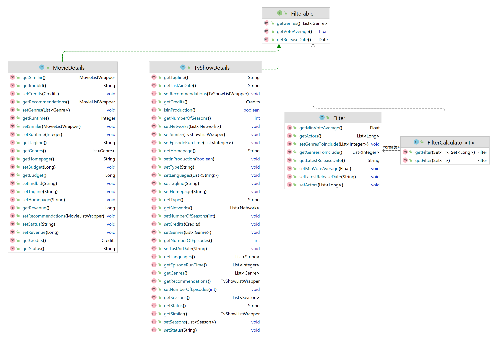

# Code

Das Kapitel Code beschreibt wichtige oder komplexe Implementationsdetails.

## Filter Calculation Logik

Der FilterCalculator implementiert das Filterable-Interface.

Der FilterCalculator erstellt schliesslich ein Filter-Objekt und setzt die entsprechenden Eigenschaften wie genresToInclude, latestReleaseDate, minVoteAverage und actors basierend auf den berechneten Werten.

Dieser Code ist skalierbar, da er eine modulare und erweiterbare Architektur aufweist. Die Klasse FilterCalculator verwendet den generischen Typ T, der von der Interface Filterable erweitert wird. Dadurch kann der FilterCalculator mit verschiedenen Filterable-Implementierungen arbeiten, was die Flexibilität und Wiederverwendbarkeit erhöht.
