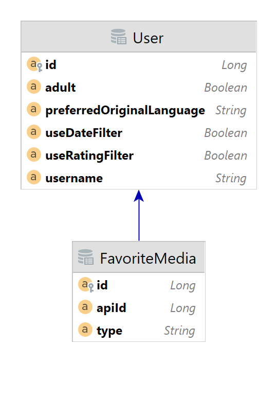

# Data

In diesem Kapitel wird das Datenmanagement einer Softwareanwendung analysiert und dokumentiert. Wichtige Fragen/Themen in diesem Zusammenhang:

- Wie sieht das Datenmodell aus?
- Wo sind die Daten gespeichert?
- Wer ist verantwortlich für die Daten (Ownership)?
- Was ist das Mengengerüst? Wie viel welcher Daten fallen an?
- Archivierung und Backup Strategien

Die aktuelle Implementierung von BIMDB weist keine komplexe Datenlogik auf, da lediglich einige Benutzereinstellungen und Daten hinsichtlich Favoriten verwaltet werden (siehe Entity-Relationship-Model unten). Der Grossteil der benötigten Daten werden zur Laufzeit über eine externe Schnittstelle bezogen und dann direkt in-memory verarbeitet.

FavoriteMedia hat einen Fremdschlüssel für den Benutzer, eine Typ-Spalte (Film, TV-Show, Person) und eine API-ID-Spalte (ID des betreffenden Favoriten in der TMDB-API).

